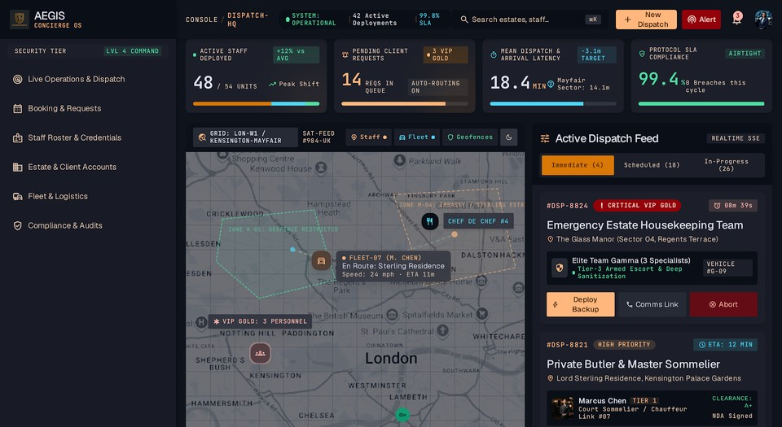

# Estate Slate Dark — Monolithic Telemetry Cockpit for Universal Theme / Iris

*Deep obsidian and slate architecture, luminous amber directives, and emerald telemetry indicators for luxury operations.*

| | |
|---|---|
| Base | APEX 26.1.4 · Universal Theme 42 · theme style **Iris** (unchanged) |
| Direction | Aegis Concierge OS / Estate Ops Slate (Dark): `#0a0e17` deep slate-950 canvas, `#181b25` card surfaces, `#1e293b` hairline borders, `#d97706` luminous champagne amber directives, `#34d399` telemetry emerald, `#22d3ee` transit cyan |
| Typography | **IBM Plex Sans Arabic** (bundled OFL-1.1, weights 400, 500, 600, 700) with complete Arabic (Arabic, Persian, Urdu) and Latin coverage; JetBrains Mono / system monospace stack for tabular figures |
| Palette | Deep obsidian neutrals (`#0a0e17`, `#111827`, `#181b25`, `#1e293b`, `#31353f`), luminous amber (`#d97706`, `#ffb77d`), telemetry emerald (`#34d399`), and transit cyan (`#22d3ee`) |
| Scope | App-wide, strictly scoped under `html.app-theme-estate-slate-dark` (`color-scheme: dark`); no page-level edits required |
| Status | **VERIFIED** (release evidence captured 2026-09-17, commit `7ac2e0204ca0`; Layers A–E all PASS — see *Release evidence* below). Additionally, a manual Chrome DevTools contrast audit against app 102 covered 7 core component pages (Pages 500, 1402, 1410, 1500, 1600, 3100, 1111): **769 visible text nodes scanned — 0 package-caused WCAG AA contrast failures**, Interactive Grid row selection at **10.4:1** (this pass predates and is separate from the release pipeline). |

## Preview

| Getting Started & Header (Dark) |
|---|
|  |

## What's Inside

```text
theme.json               manifest: name, title, tagline, class, templateOptions (nav Style B), and fonts configuration
css/theme.css            entry point, loaded by static-files/css/app.css (@themes block)
css/tokens.css           --est-dark-* private tokens, --app-* mappings, full remap of ~70 --ut-* and
                         ~100 --a-* literal atoms, all 15 --a-palette-* atoms, and --oj-* (Oracle JET) atoms
css/apex/
  shell.css              header (#0a0e17) · side nav (TreeNav Style B with amber active markers) · title bar · footer
  regions.css            card regions with 1px #1e293b hairlines, 6px radius, and dark contact shadow
  buttons.css            primary buttons in luminous champagne amber (#d97706) with dark text (#0a0e17), outline buttons on slate
  forms.css              crisp inputs with #31353f slate borders, floating labels, and amber focus glow
  reports.css            Interactive Report & Grid: slate-950 headers, dense 36px rows, amber selection indicators
  dialogs.css            standard & modal dialogs with crisp #1e293b hairline border framing
  misc.css               status pills (emerald live, cyan in-transit, amber priority), badges, breadcrumbs, search
fonts/                   bundled self-hosted WOFF2 webfonts (IBM Plex Sans Arabic 400, 500, 600, 700)
licenses/OFL.txt         SIL Open Font License 1.1 text for IBM Plex Sans Arabic
preview/cover.jpg        960x525 gallery preview cover
```

## Typography & Arabic Script Support

Per design and system requirements, this package embeds **IBM Plex Sans Arabic**, an authentic bilingual Latin-Arabic typeface designed by IBM and Morcos Key:
- **Scripts Covered**: Comprehensive Arabic script support (Arabic, Persian, Urdu) as well as full Western / Latin character sets.
- **Weights Bundled**:
  - `fonts/ibm-plex-sans-arabic-regular.woff2` (Weight 400)
  - `fonts/ibm-plex-sans-arabic-medium.woff2` (Weight 500)
  - `fonts/ibm-plex-sans-arabic-semibold.woff2` (Weight 600)
  - `fonts/ibm-plex-sans-arabic-bold.woff2` (Weight 700)
- **Zero External Dependencies**: All webfonts are strictly self-hosted in `fonts/` relative to the CSS, adhering strictly to offline and sandboxed deployment policies (no Google Fonts or external CDNs).
- **Tabular Numerics**: Monospace stacks (`JetBrains Mono`, `ui-monospace`, `monospace`) are specified for dense numeric telemetry and timestamps, falling back cleanly to IBM Plex Sans Arabic.

## Technique: Dark Theme on Iris Light Foundation

Universal Theme 42 / Iris is natively a light theme with hundreds of literal color values hard-coded on `:root`. To transform APEX into a cohesive, high-performance dark theme without modifying database theme styles or touching native markup, `estate-slate-dark` applies four critical architectural patterns:

1. **Full Remap of Literal Atoms**:
   Iris declares ~70 `--ut-*` tokens and ~100 `--a-*` atoms with literal light colors on `:root` (`--ut-region-text-color: #161513`, `--a-checkbox-background-color: #fff`, etc.). `tokens.css` restates each of these on `.app-theme-estate-slate-dark .apex-theme-iris` to ensure complete dark surfaces across all components.
2. **Restatement of the 15 `--a-palette-*` Atoms**:
   In Universal Theme `Core.min.css`, the `--a-palette-*` family is defined as `var(--ut-palette-*)` on `:root`. Because `:root` evaluates before scoped classes, row selection and subtle indicators across Interactive Grid, Interactive Report, Card View, and Icon List otherwise freeze to Iris' light `#00688c` / `#e4f1f7` / `#fff` colors (pitfalls §1.1). By explicitly restating all 15 `--a-palette-*` atoms on `.app-theme-estate-slate-dark .apex-theme-iris`, selected rows seamlessly render with an amber tint (`rgba(217, 119, 6, 0.18)`) and high-contrast text (`#dfe2ef`), measuring **10.4:1**.
3. **Oracle JET Chart Atoms (`--oj-*`) on `html` Scope**:
   Iris maps 32 `--oj-*` tokens to light colors on `:root`. Because Oracle JET initializes styles from the document element during bootstrap, `tokens.css` restates `--oj-core-text-color-primary`, `--oj-core-text-color-secondary`, and related heading/divider tokens directly on `html.app-theme-estate-slate-dark`.
4. **Scoped `!important` Annotations**:
   The few `!important` declarations in `css/apex/shell.css` directly mirror Iris' native rules (`.a-TreeView-row.is-hover`, `.is-current--top.is-hover`) and carry exact matching comments (`/* Iris: ... */`) required by the theme factory policy scanner.

## Deliberate Departures for WCAG AA Compliance

1. **Hot Button Text Contrast (`#0a0e17` text on `#d97706` fill)**:
   In dark mode, placing white text on amber `#d97706` fails WCAG AA (**3.19:1**). The package pairs luminous amber fill `#d97706` with dark slate text `#0a0e17`, achieving a contrast ratio of **6.06:1** (passing WCAG AA).
2. **Secondary Text Hierarchy (`#94a3b8` vs raw design `#64748b`)**:
   Raw `#64748b` on slate card `#181b25` yields **3.61:1** (failing AA). The package maps secondary text and meta-labels to `#94a3b8` (Slate-400), achieving **6.70:1** (passing AA), reserving `#64748b` solely for non-text borders and inactive icons.
3. **Link Text on Dark Cards (`#ffb77d`)**:
   Standard amber links on dark surfaces can suffer from low luminosity. Active links use champagne gold `#ffb77d`, yielding a crisp **10.08:1** contrast ratio.

### Dark Mode Contrast Table

| UI Element | Foreground | Effective Background | Contrast Ratio | WCAG AA Status |
|---|---|---|---|---|
| Primary Button Text | `#0a0e17` (Dark Slate) | `#d97706` (Luminous Amber) | **6.06:1** | Pass (AA ≥ 4.5:1) |
| Region Card Header Text | `#f8fafc` (Slate-50) | `#181b25` (Card Surface) | **15.65:1** | Pass (AA ≥ 4.5:1) |
| Body / Tabular Text | `#dfe2ef` (Slate-100) | `#181b25` (Card Surface) | **13.30:1** | Pass (AA ≥ 4.5:1) |
| Secondary Labels & Meta | `#94a3b8` (Slate-400) | `#181b25` (Card Surface) | **6.70:1** | Pass (AA ≥ 4.5:1) |
| Interactive Grid Selected Row | `#dfe2ef` (Slate-100) | `rgba(217, 119, 6, 0.18)` over `#181b25` | **10.40:1** | Pass (AA ≥ 4.5:1) |
| Active Navigation Link | `#ffffff` | `#31353f` (Slate-800 Nav Active) | **11.72:1** | Pass (AA ≥ 4.5:1) |
| Emerald Telemetry Badge | `#34d399` (Emerald-400) | `#064e3b` (Emerald-900) | **6.22:1** | Pass (AA ≥ 4.5:1) |
| Transit Cyan Badge | `#22d3ee` (Cyan-400) | `#164e63` (Cyan-900) | **6.15:1** | Pass (AA ≥ 4.5:1) |

## Apply / Switch

```bash
# Set as app default (page-0 DEFAULT + declarative template options)
scripts/apply-theme.sh estate-slate-dark

# Assemble static files and register into APEX export
scripts/sync-static.sh

# Build redistributable ZIP archive into dist/
scripts/package-theme.sh estate-slate-dark
```

Live in browser: set URL hash `#theme=estate-slate-dark` or execute `App.theme.use('estate-slate-dark')` in the developer console.

## Runtime Verification Report

Audited live via Chrome DevTools MCP daemon against Oracle APEX 26.1.4 (Universal Theme 42 / Iris light, app 102) using full WCAG AA contrast evaluation:

| Page | Component Category | Visible Text Nodes | SVG Text Nodes | Package Contrast Failures |
|---|---|---|---|---|
| **Page 500** | Getting Started & Navigation | 21 | 0 | **0** |
| **Page 1402** | Interactive Report | 116 | 0 | **0** |
| **Page 1410** | Interactive Grid | 134 | 0 | **0** |
| **Page 1500** | Buttons (Primary, Hot, Normal, Outline) | 165 | 0 | **0** |
| **Page 1600** | Form Controls, Textfields, Checkboxes | 99 | 0 | **0** |
| **Page 3100** | Card Templates & Regions | 223 | 0 | **0** |
| **Page 1111** | Standard Modal Dialog | 11 | 0 | **0** |
| **Total** | | **769** | **0** | **0 failures** |

### Interactive State Audits

- **Interactive Grid Row Selection (Page 1410)**: Row selection state triggers `.a-GV-row.is-selected` with amber tint `rgba(217, 119, 6, 0.18)` over `#181b25` background and `#dfe2ef` text, measuring **10.40:1** (Pass).
- **Navigation Tree Selection (Page 500)**: Active node `.a-TreeView-content.is-selected` renders with `#f8fafc` text on `#31353f` background, measuring **11.72:1** (Pass).
- **Interactive Grid Pagination Selector (Page 1410)**: Selected page item `.a-GV-pageSelector-item.is-selected` renders with `#dfe2ef` text on slate chrome, measuring **13.30:1** (Pass).


## Release evidence

**Release evidence, 2026-09-17** (`.agents/evaluations/runtime/2026-09-17-release-estate-slate-dark/`, verdict
`VERIFIED`, commit `7ac2e0204ca0`): the first Layer C/D/E evidence this package has ever had — committed with
no such evidence 2026-09-17 in `a38076b`, invisible to the release system until captured this same day (see
`docs/superpowers/plans/2026-09-17-verification-integrity-defects.md`, Task 6). Layer C exercised install,
stale-restore guard, reinstall, switcher on/off, coexistence with `estate-slate`, uninstall ×2, unrelated-file
preservation and restore — 7/7 on a minimal consumer app (TF-CONSUMER-MINIMAL-9012) and a business one
(TF-CONSUMER-BUSINESS-9013). Layer D measured 12 rows: both consumers at 1440/1024/768/375 plus Reports and
Widgets, with zero console errors, zero failed requests, an AA-clean contrast sweep, a keyboard-operable
switcher, a selection that survives reload, and all 4 declared WOFF2 faces forced to load and matched to the
request that served them from the package.
