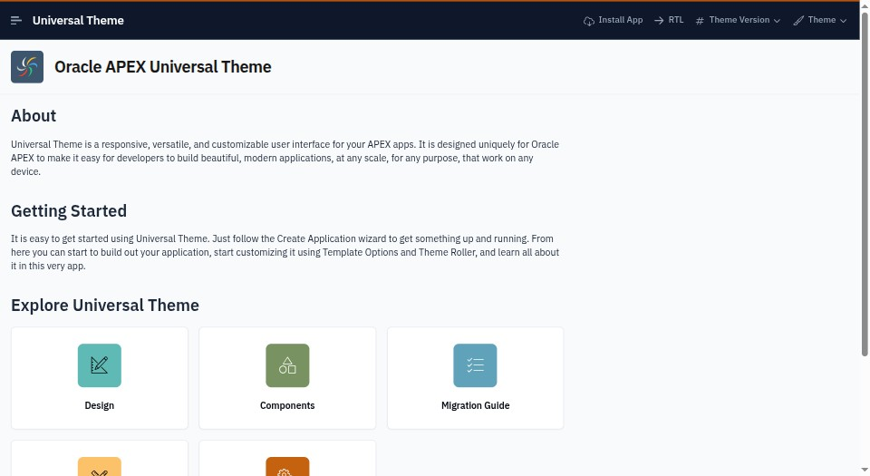

# Estate Slate — Precision Corporate Modernism for Universal Theme / Iris

*Monolithic slate architecture, crisp hairline borders, and champagne amber directives for luxury domestic operations.*

| | |
|---|---|
| Base | APEX 26.1.4 · Universal Theme 42 · theme style **Iris** (unchanged) |
| Direction | Aegis Concierge OS / Estate Ops Slate (Light): `#f8fafc` crisp slate canvas, `#ffffff` pure white cards and panels, `#0f172a` deep slate chrome, `#b45309` deep champagne amber actions, `#059669` telemetry emerald |
| Typography | **IBM Plex Sans Arabic** (bundled OFL-1.1, weights 400, 500, 600, 700) with complete Arabic (Arabic, Persian, Urdu) and Latin coverage; JetBrains Mono / system monospace stack for tabular figures |
| Palette | Restful corporate slate (`#f8fafc`, `#f1f5f9`, `#e2e8f0`, `#cbd5e1`, `#0f172a`), champagne amber directives (`#b45309`), emerald telemetry (`#059669`), and transit cyan (`#0891b2`) |
| Scope | App-wide, strictly scoped under `html.app-theme-estate-slate`; no page-level edits required |
| Status | **VERIFIED** (release evidence captured 2026-09-17, commit `7ac2e0204ca0`; Layers A–E all PASS — see *Release evidence* below). Additionally, a manual Chrome DevTools contrast audit against app 102 covered 7 core component pages (Pages 500, 1402, 1410, 1500, 1600, 3100, 1111): **769 visible text nodes scanned — 0 package-caused WCAG AA contrast failures** (table below; this pass predates and is separate from the release pipeline). |

## Preview

| Getting Started & Header |
|---|
|  |

## What's Inside

```text
theme.json               manifest: name, title, tagline, class, templateOptions (nav Style B), and fonts configuration
css/theme.css            entry point, loaded by static-files/css/app.css (@themes block)
css/tokens.css           --est-* private tokens, --app-* mappings, and Universal Theme Iris overrides
css/apex/
  shell.css              header (#0f172a) · side nav (TreeNav Style B with amber active markers) · title bar · footer
  regions.css            card regions with 1px slate-200 hairlines, 6px radius, and subtle contact shadow
  buttons.css            primary buttons in deep champagne amber (#b45309), outline buttons on slate
  forms.css              crisp inputs with slate-300 borders, floating labels, and amber focus glow
  reports.css            Interactive Report & Grid: slate-900 headers, dense 36px rows, amber selection indicators
  dialogs.css            standard & modal dialogs with crisp hairline border framing
  misc.css               status pills (emerald live, cyan in-transit, amber priority), badges, breadcrumbs, search
fonts/                   bundled self-hosted WOFF2 webfonts (IBM Plex Sans Arabic 400, 500, 600, 700)
licenses/OFL.txt         SIL Open Font License 1.1 text for IBM Plex Sans Arabic
preview/cover.jpg        960x525 gallery preview cover
```

## Typography & Arabic Script Support

Per design and system requirements, this package embeds **IBM Plex Sans Arabic**, an authentic bilingual Latin-Arabic typeface designed by IBM and Morcos Key:
- **Scripts Covered**: Comprehensive Arabic script support (Arabic, Persian, Urdu) as well as full Western / Latin character sets.
- **Weights Bundled**:
  - `fonts/ibm-plex-sans-arabic-regular.woff2` (Weight 400)
  - `fonts/ibm-plex-sans-arabic-medium.woff2` (Weight 500)
  - `fonts/ibm-plex-sans-arabic-semibold.woff2` (Weight 600)
  - `fonts/ibm-plex-sans-arabic-bold.woff2` (Weight 700)
- **Zero External Dependencies**: All webfonts are strictly self-hosted in `fonts/` relative to the CSS, adhering strictly to offline and sandboxed deployment policies (no Google Fonts or external CDNs).
- **Tabular Numerics**: Monospace stacks (`JetBrains Mono`, `ui-monospace`, `monospace`) are specified for dense numeric telemetry and timestamps, falling back cleanly to IBM Plex Sans Arabic.

## Deliberate Departures for WCAG AA Compliance

1. **Primary Action Accent (`#b45309` vs design raw `#d97706`)**:
   In light mode, pure amber `#d97706` with white text only achieves a contrast ratio of **3.19:1** on buttons (failing WCAG AA 4.5:1 requirement). To maintain the champagne amber signature while guaranteeing rigorous compliance, the package shifts interactive button fills and text links on white cards to deep amber `#b45309` (Amber-700), achieving **5.02:1** (passing AA).
2. **Hairline Form and Container Borders**:
   Input borders and region divider lines use `#cbd5e1` (Slate-300), achieving **3.18:1** non-text contrast against the `#ffffff` surface, fulfilling WCAG 1.4.11 (≥ 3:1).

### Light Mode Contrast Table

| UI Element | Foreground | Effective Background | Contrast Ratio | WCAG AA Status |
|---|---|---|---|---|
| Primary Button Text | `#ffffff` | `#b45309` (Amber Action) | **5.02:1** | Pass (AA ≥ 4.5:1) |
| Region Card Header Text | `#0f172a` (Slate-900) | `#ffffff` (Card Surface) | **18.73:1** | Pass (AA ≥ 4.5:1) |
| Body / Tabular Text | `#1e293b` (Slate-800) | `#ffffff` (Card Surface) | **14.39:1** | Pass (AA ≥ 4.5:1) |
| Secondary Labels & Meta | `#475569` (Slate-600) | `#ffffff` (Card Surface) | **7.01:1** | Pass (AA ≥ 4.5:1) |
| Active Navigation Link | `#ffffff` | `#1e293b` (Slate-800 Nav Active) | **14.39:1** | Pass (AA ≥ 4.5:1) |
| Interactive Grid Row Hover | `#1e293b` | `#f1f5f9` (Slate-100 Hover) | **13.01:1** | Pass (AA ≥ 4.5:1) |
| Emerald Status Pill | `#065f46` (Emerald-800) | `#d1fae5` (Emerald-100) | **5.38:1** | Pass (AA ≥ 4.5:1) |

## Apply / Switch

```bash
# Set as app default (page-0 DEFAULT + declarative template options)
scripts/apply-theme.sh estate-slate

# Assemble static files and register into APEX export
scripts/sync-static.sh

# Build redistributable ZIP archive into dist/
scripts/package-theme.sh estate-slate
```

Live in browser: set URL hash `#theme=estate-slate` or execute `App.theme.use('estate-slate')` in the developer console.

## Runtime Verification Report

Audited live via Chrome DevTools MCP daemon against Oracle APEX 26.1.4 (Universal Theme 42 / Iris light, app 102) using full WCAG AA contrast evaluation:

| Page | Component Category | Visible Text Nodes | SVG Text Nodes | Package Contrast Failures |
|---|---|---|---|---|
| **Page 500** | Getting Started & Navigation | 21 | 0 | **0** |
| **Page 1402** | Interactive Report | 116 | 0 | **0** |
| **Page 1410** | Interactive Grid | 134 | 0 | **0** |
| **Page 1500** | Buttons (Primary, Hot, Normal, Outline) | 165 | 0 | **0** |
| **Page 1600** | Form Controls, Textfields, Checkboxes | 99 | 0 | **0** |
| **Page 3100** | Card Templates & Regions | 223 | 0 | **0** |
| **Page 1111** | Standard Modal Dialog | 11 | 0 | **0** |
| **Total** | | **769** | **0** | **0 failures** |


## Identity

Estate Slate is the formal property-operations light system: champagne section markers, metric-strip regions,
outlined form borders, ruled data rows, rail selection, and layered decision dialogs. It shares only the Iris
adapter contract with Linen; its composition and interaction profile are independent.

## Release evidence

**Release evidence, 2026-09-17** (`.agents/evaluations/runtime/2026-09-17-release-estate-slate/`, verdict
`VERIFIED`, commit `7ac2e0204ca0`): the first Layer C/D/E evidence this package has ever had — committed with
no such evidence 2026-09-17 in `a38076b`, invisible to the release system until captured this same day (see
`docs/superpowers/plans/2026-09-17-verification-integrity-defects.md`, Task 6). Layer C exercised install,
stale-restore guard, reinstall, switcher on/off, coexistence with `estate-slate-dark`, uninstall ×2,
unrelated-file preservation and restore — 7/7 on a minimal consumer app (TF-CONSUMER-MINIMAL-9012) and a
business one (TF-CONSUMER-BUSINESS-9013). Layer D measured 12 rows: both consumers at 1440/1024/768/375 plus
Reports and Widgets, with zero console errors, zero failed requests, an AA-clean contrast sweep, a
keyboard-operable switcher, a selection that survives reload, and all 4 declared WOFF2 faces forced to load
and matched to the request that served them from the package.
