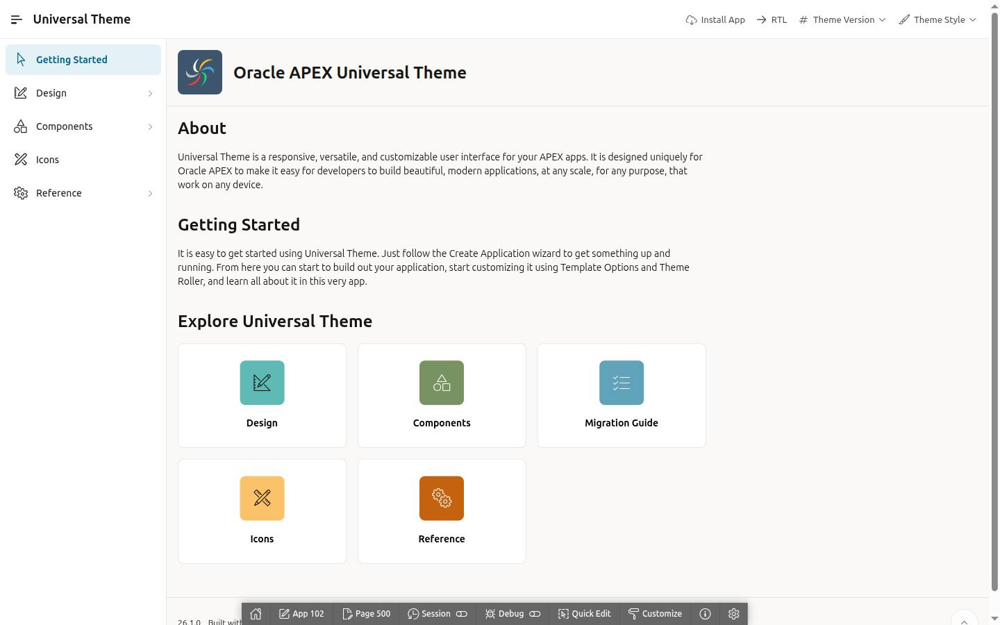
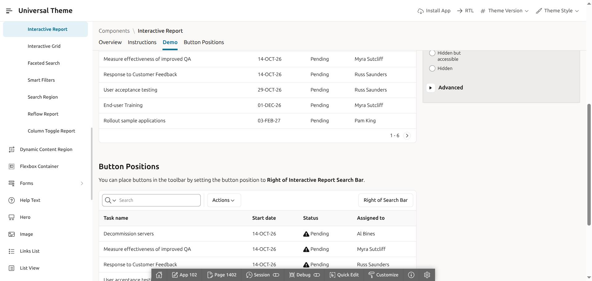
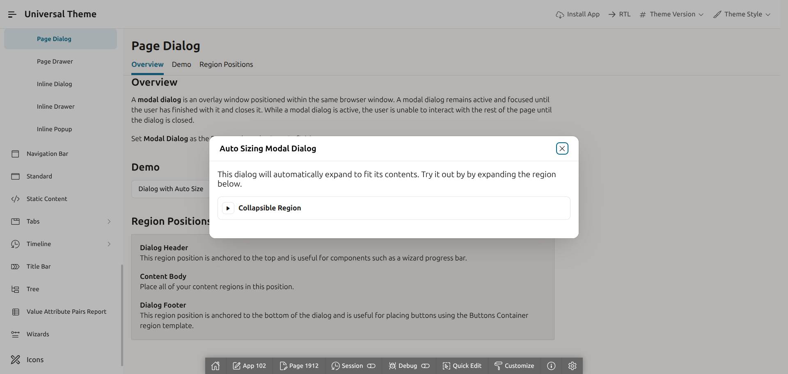
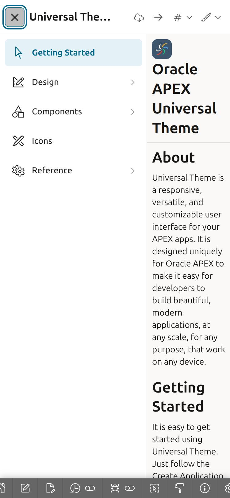

# Linen — a quiet-product look for Universal Theme / Iris

*Light linen canvas, hairline seams, one teal thread.*

| | |
|---|---|
| Base | APEX 26.1.4 · Universal Theme 42 · theme style **Iris** (unchanged) |
| Direction | "Quiet product": white chrome, hairline borders, flat 8px surfaces, tighter density, Iris teal `#00688c` reserved for actions and selection |
| Palette / font | Iris palette and Oracle Sans, untouched — every colour is an Iris token alias |
| Scope | app-wide, one CSS layer; no page-level edits |
| Spec | [docs/superpowers/specs/2026-09-13-modern-look-design.md](../../docs/superpowers/specs/2026-09-13-modern-look-design.md) |
| Applied to app 102 | 2026-09-13 (import `2eb072f` + this package) |

## Preview

| Getting Started (1440) | Interactive Report | Modal dialog | Mobile nav (375) |
|---|---|---|---|
|  |  |  |  |

## What's inside

```text
theme.json               manifest: name, class, declarative template options (nav Style B)
css/theme.css            entry, loaded by static-files/css/app.css (@themes block, generated)
css/tokens.css           token deltas over the shared foundation, scoped to html.app-theme-linen
css/apex/
  shell.css              header (white, no accent strip) · side nav (white, Style B pill, teal-on-shade current) · title bar · hero
  regions.css            regions/cards 8px + hairline + no shadow · 14px/600 titles · content-block scale 24/20/17 · breadcrumb title
  buttons.css            36px / 13px-500 / 6px · default white+hairline · hot + button-group teal · :focus-visible ring
  forms.css              6px inputs · teal focus halo · 13px/500 muted stacked labels
  reports.css            IRR / IG / classic: subtle 40px header 13px/600 · 40px rows · horizontal hairlines · tabular numerals
  dialogs.css            12px radius · single soft shadow · hairline title bar · menus
  misc.css               alert/badge/component shadows off · badge radius
preview/                 captures
```
Shared foundation (reset, typography, utilities, the full `--app-*` vocabulary with Iris defaults) lives in
`static-files/css/foundation/` and is not part of the package.

## Technique

Every rule is scoped to `html.app-theme-linen`, so all theme packages can be loaded together and the
class chosen per visitor (page 0 "Theme" regions apply it before paint; see `sample-themes/README.md`).

Core/Iris declare each component's *base* atoms (`--a-button-*`, `--a-field-*`, `--a-gv-*`, `--jui-dialog-*`,
most `--ut-*`) on `:root` and every modifier/state on the element. Linen overrides the base atoms on
`body.apex-theme-iris` (the theme-style scope — never `:root`), so `--small`, `--hot`, `--header`, floating
labels, palette buttons etc. keep precedence. Atoms set on an element (`.a-IRR{--a-gv-border-radius}`) are
overridden on that element; the three `!important`s mirror Iris' own and are commented.
Detaching `css/app.css` restores Iris exactly.

## Declarative requirements (already in `applications/ut/application.apx`)

```apexlang
css {
    fileUrls: #APP_FILES#css/app.css
}
navigationMenu { templateOptions: [ … t-TreeNav--styleB ] }   # Side Navigation Menu → Style: Style B
```

## Apply / switch

```bash
scripts/apply-theme.sh linen      # make it the app default (page-0 DEFAULT + template options from theme.json)
scripts/sync-static.sh            # assemble static-files + sample-themes/*/css into the APEXLang export
scripts/apex-import.sh            # validate + import
```
Live, per browser: open any page with `#theme=linen` (or `App.theme.use('linen')` in the console);
`#theme=none` shows bare Iris, `#theme=default` returns to the app default.

## Identity

Linen is the quiet application default: minimal text-led navigation, editorial title tracking, hairline
separators, flat paper regions, and underline-selected actions. It is a standalone Iris package, not a parent
theme or scaffold source for the other packages.

## Verified

Pages 500, 1201, 1402, 1410, 1500, 1600, 1910 · widths 1440 / 1024 / 768 / 375 · console clean ·
IG refresh, dialog open/close, keyboard focus · text contrast ≥ 5.4:1, input border 3.3:1.
Runtime hooks recorded in `.agents/knowledge/ut-dom-*.md`. No findings are open against this package.

**Release evidence, 2026-09-17** (`.agents/evaluations/runtime/2026-09-17-release-linen/`, verdict
`VERIFIED`, commit `7ac2e0204ca0`): Layer C exercised install, stale-restore guard, reinstall, switcher on/off,
coexistence with `solarized-dark`, uninstall ×2, unrelated-file preservation and restore — 7/7 on a minimal consumer app and a
business one. Layer D measured 12 rows: both consumers at 1440/1024/768/375 plus Reports and Widgets, with
zero console errors, zero failed requests, an AA-clean contrast sweep, a keyboard-operable switcher and a
selection that survives reload.
