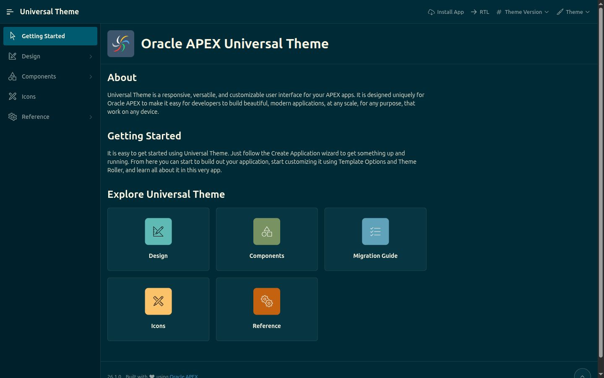
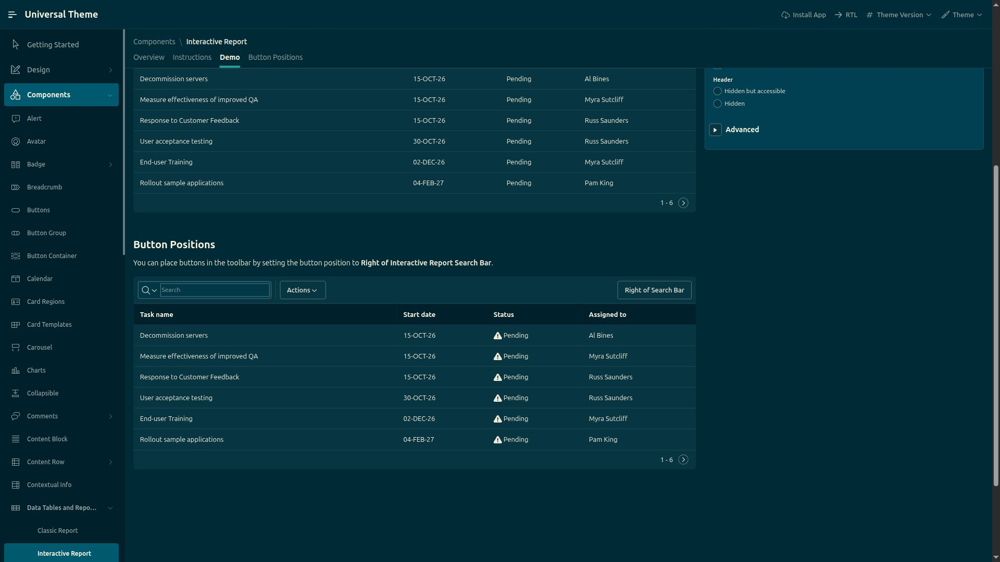
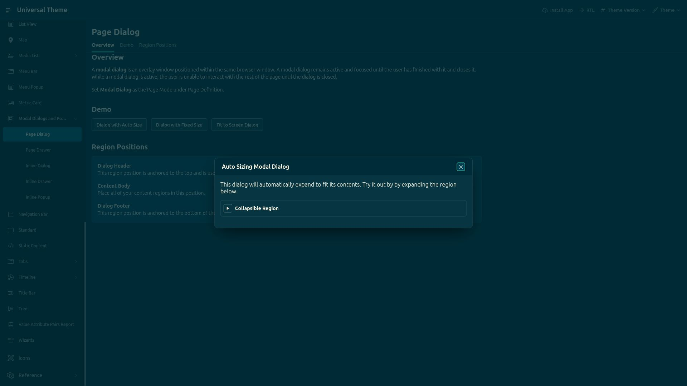
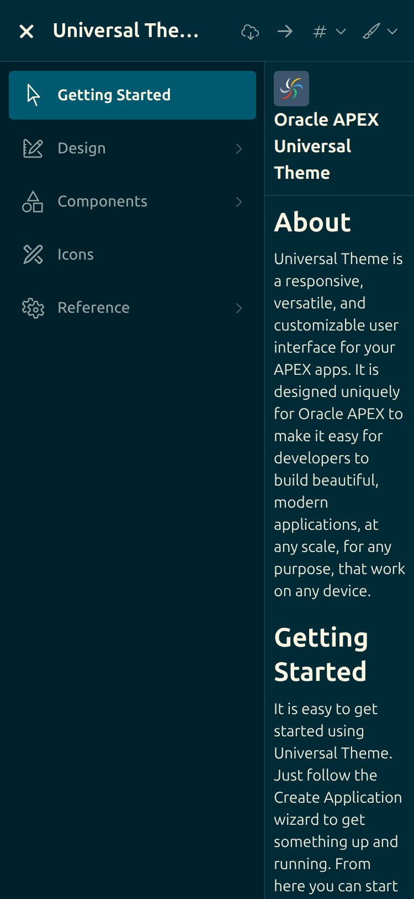

# Solarized Dark — a VS Code developer look for Universal Theme / Iris

*Precision terminal cyan and deep solarized blues.*

| | |
|---|---|
| Base | APEX 26.1.4 · Universal Theme 42 · theme style **Iris** (unchanged) |
| Direction | VS Code Solarized Dark: `#002b36` editor canvas, `#073642` regions and cards, `#00212b` chrome, cyan `#2aa198` for actions and selection, blue for links |
| Palette | Ethan Schoonover's Solarized (VS Code bundled theme); UI surfaces (input, hover, selected) are VS Code's own |
| Scope | app-wide, one CSS layer scoped under `html.app-theme-solarized-dark`; no page-level edits (the reference app's own `.dm-*` demo surfaces are restated in `misc.css`) |
| Status | 2026-09-17: release verdict **`VERIFIED`** (Layers A–E, `.agents/evaluations/runtime/2026-09-17-release-solarized-dark/`). A live pass over 24 pages found four package-caused defects; all four are fixed, imported and **re-measured as shipped** — 0 package-caused AA failures on the swept surfaces. Coverage is 24 of 122 pages of app 102 and two widths there, so this is verified-for-what-was-measured, not exhaustively |

## Preview

| Getting Started (1440) | Interactive Report (1920) | Modal dialog (1920) | Mobile nav (375) |
|---|---|---|---|
|  |  |  |  |

## What's inside

```text
theme.json               manifest: name, title, tagline, direction, class, declarative template options (nav Style B)
css/theme.css            entry, loaded by static-files/css/app.css (@themes block, generated)
css/tokens.css           --sol-* palette, --app-* deltas + --oj-* (JET) remaps (html scope),
                         --ut-* / --a-* remaps incl. the --a-palette-* family (body scope)
css/apex/
  shell.css              header (#002c39) · side nav (#00212b, #005a6f pill, light text) · title bar · footer
  regions.css            Cards-region atoms · wizard (cyan active, green complete) · card list · metric card · headings
  buttons.css            36px / 13px-500 / 4px · default card surface + 3:1 border · hot cyan/dark text · primary blue-text
  forms.css              4px inputs on #003847 · 3.3:1 border · cyan focus · 13px/500 labels · floating labels
  reports.css            IRR / IG / classic: #00212b header 13px/600 · 40px rows · solid hover · themed pager and footer
  dialogs.css            jQuery UI dialog and menu atoms · wizard dialog pages
  misc.css               shadows off · badges · tabs · alert accent edge · Prism.js code samples ·
                          faceted search · percent graph · help dialog · map legend + attribution ·
                          chart tooltips · FullCalendar default events
preview/                 cover.jpg (gallery) + the four captures above
```

Shared foundation (reset, typography, utilities, the full `--app-*` vocabulary with Iris defaults) lives in
`static-files/css/foundation/` and is not part of the package.

## Technique

Same as [linen](../linen/README.md): every rule is scoped to `html.app-theme-solarized-dark`; Universal Theme
tokens and component atoms are overridden on `body.apex-theme-iris` (never `:root`) so every modifier keeps
precedence. Two things a dark package must do that a light one can skip:

- **Remap the literal tokens.** Iris declares ~70 `--ut-*` tokens and ~100 `--a-*` atoms with *literal* light
  colours on `:root` (`--ut-region-text-color: #161513`, `--a-checkbox-background-color: #fff`, …). They do not
  follow `--ut-component-*`, so `tokens.css` restates each of them. Some Iris values are `var()` chains that
  resolve at `:root` (`--a-gv-pagination-button-text-color: var(--a-button-text-color)`), so the derived atom
  has to be set as well. Widget state atoms live in `/i/app_ui/css/Theme-Standard.min.css`
  (`--a-gv-pagination-button-selected-background-color`, fallback `#e0e0e0`).
- **Restate the whole atom family, not just the atoms you can see.** The same `:root` freeze applies to
  families a page-by-page review never reaches: `--a-palette-*` (15 atoms, declared as `var(--ut-palette-*)`
  on `:root` in `Core.min.css`) drives every *selection* state in the app, and Oracle JET's `--oj-*` family is
  mapped onto `--ut-*` on `:root` by `Iris.min.css`. Both were missed until the 2026-09-17 live pass; see
  *Status*. Third-party surfaces that take their text by inheritance (MapLibre's attribution plate) need a
  rule of their own.
- **Keep the hierarchy inside AA.** See below.

The five `!important`s in `shell.css` mirror Iris' own (`.a-TreeView-row.is-hover{…!important}`,
`.is-current--top.is-hover{color:#fff!important;background-color:#006c91!important}`) and are commented.

## Deviation from Solarized: text levels

Solarized's dark hierarchy is base1 / base0 / base01. On the `#073642` card surface those measure 4.9 / 4.1 /
2.4:1 — only base1 passes AA for 13–14px text. The package therefore uses **base3 / base2 / base1**
(titles / body / secondary) and tints the accents that are used *as text*:

| Role | Colour | On card `#073642` | On canvas `#002b36` |
|---|---|---|---|
| titles, input text (`--app-text-emphasized`) | base3 `#fdf6e3` | 12.0 | 13.9 |
| body (`--app-text-primary`) | base2 `#eee8d5` | 10.6 | 12.3 |
| labels, subtitles, placeholders (`--app-text-secondary`) | base1 `#93a1a1` | 4.9 | 5.6 |
| links, primary palette (`--sol-blue-text`) | `#4b9fda` (blue +17 % white) | 4.5 | 5.2 |
| validation / danger text (`--sol-red-text`) | `#e87674` (red +33 %) | 4.5 | 5.2 |
| dark text on cyan / green / yellow / blue-text fills (`--app-text-on-accent`) | base03 `#002b36` | 4.75 / 4.7 / 4.7 / 5.2 | |
| white on the red badge | `#ffffff` | 4.6 | |
| code (Prism, on the canvas): keyword green, string cyan, comment base0, number `#e174a9`, entity `#db815c` | | | 4.7 / 4.75 / 4.75 / 5.2 / 5.2 |
| input border (`--app-border-strong`) vs card — WCAG 1.4.11 | `rgba(131,148,150,.8)` | 3.3 | 3.6 |

Accents kept raw for icons, markers, highlight bars and large text (≥ 3:1): cyan 4.1, green 4.1, yellow 4.1 on cards.

## Apply / switch

```bash
scripts/apply-theme.sh solarized-dark   # make it the app default (page-0 DEFAULT + template options from theme.json)
scripts/sync-static.sh                  # assemble static-files + sample-themes/*/css into the APEXLang export
scripts/apex-import.sh                  # validate + import
```
Live, per browser: navigation-bar **Theme** menu or page 405 *Themes*; `#theme=solarized-dark` in a URL;
`App.theme.use('solarized-dark')` in the console.

## Status: live-measured 2026-09-17, four defects fixed — NOT release-verified

**Not "Verified".** A live Chrome pass finally ran (2026-09-17, details below). It is the first runtime
evidence this package has, and it changes the picture in both directions: the 2026-09-14 resting-state numbers
reproduced, *and* the pass found four real package-caused defects that no resting-state sweep could ever see —
one of them (Interactive Grid row selection at **1.06:1**) severe.

Two of the three blockers recorded here are now closed (2026-09-17, after the import; full log in
`.agents/evaluations/runs/2026-09-17/11-dark-package-coverage-postimport.md`):

1. ~~The fixes have never been rendered.~~ **Closed.** They were built, imported and re-swept as shipped:
   24 pages at 1440 and 4 at 375 report 7 failures, **0 package-caused** — the remaining two groups (p1304
   badges, p1800 `apex-cal-green`) measure byte-identical with and without `html.app-theme-solarized-dark`, so
   they are Universal Theme / APEX literals. The four fixed defects re-measured *as rendered*: IG row selection
   **8.17:1**, faceted search 0 failures, MapLibre **12.25:1**, date picker current day **10.61:1**.
2. ~~The JET chart fix cannot be validated at all.~~ **Closed by the import.** p1902 now measures **25 of 25
   SVG text nodes passing**, worst 4.86:1, fills `rgb(238,232,213)` (base2, 5 nodes) and `rgb(147,161,161)`
   (base1, 20) — previously 24 of 25 failed at 1.46–1.62:1. The audit itself was extended to score SVG `fill`,
   which is why the page no longer reads as falsely clean.
3. **Coverage is still 24 of 122 pages**, one desktop width plus four pages at 375 — unchanged, and the reason
   this package is called verified-for-what-was-measured rather than simply Verified. See *Still required*.

### 2026-09-17 live Chrome pass (APEX 26.1.4 / Iris, app 102) — what was actually measured

Method: own background tab through the project Chrome MCP daemon; theme applied before paint (the browser's
stored theme was already `solarized-dark`, so no `#theme=` navigation and no `localStorage` write); viewport
`1440x900x1`, plus `375x812x2,mobile,touch` for four pages. The audit is the documented
`docs/CHROME_DEVTOOLS_MCP.md` snippet (every visible text node vs its composited effective background, AA
thresholds), extended with a *light-surface sweep* (any opaque background of relative luminance ≥ 0.6 and
≥ 300 px² — the "stayed white" failure mode a contrast audit cannot see, since a light-on-light pair can still
pass AA).

**Pages (24):** 500, 405, 423, 1202, 1208, 1304, 1402, 1405, 1410, 1411, 1412, 1500, 1600, 1601, 1800, 1902,
1903, 1906, 1910, 3003, 3110, 4000, 6303, 6304 — plus dialog page 1912 inside its iframe (opened from 1910).
**4 469 visible text nodes measured. Console: 0 errors on every page.** That includes all 14 pages of the
2026-09-14 baseline, whose resting-state "0 package failures" claim is hereby independently reproduced — and
shown to be insufficient, because every defect below is a state, a widget-rendered glyph, or a non-text
surface.

**Resting-state failures: 10 → 3 package-caused → 0 after the fix.**

| Page | What fails | Measured | After the fix | Owner |
|---|---|---|---|---|
| 1411 | Faceted Search `Show All` / `Clear All` text buttons | #0e7295 on `#073642` = **2.39:1** | 4.50:1 | package (fixed) |
| 1906 | MapLibre attribution bar text and its links | base2 on the white plate = **2.57:1** | 12.25:1 | package (fixed) |
| 1304 | `t-BadgeList` demo values, white on `--u-color-2` `#de7f11` / `#b47282` | 2.94:1 / 3.70:1 | unchanged | Universal Theme (`--u-color-*` literals; the package never touches them — identical under plain Iris) |
| 1800 | Calendar `apex-cal-green` events, white on `#2ecc71` | 2.10:1 ×5 | unchanged | APEX (`#2ecc71` is a literal in `app_ui-Core.min.css`'s `apex-cal-*` classes) |

**Non-resting-state failures — the ones that matter, and the reason a resting sweep is not a verification:**

| Where | State | Measured | After the fix |
|---|---|---|---|
| p1410 Interactive Grid | select a row | cells paint Iris' `#e4f1f7` under base2 text: **1.06:1** — the row becomes unreadable | 8.17:1 (cells take the package's cyan wash) |
| p1601 date picker | open the picker | current day is a light `#e4f1f7` chip (5.43:1, so *AA-passing and still wrong*) in a dark calendar | **10.61:1** — post-import the chip is gone entirely; no day cell measures below that |
| p1902 JET charts | at rest, but SVG-rendered | axis/group/legend labels `rgba(0,0,0,.65)` = **1.46:1**, series labels `#000` = 1.62:1; **24 of 25 chart text nodes fail** | **25 of 25 pass**, worst 4.86:1 — measured post-import 2026-09-17 |

The chart failures are invisible to the documented audit because it reads CSS `color`; SVG text takes its
colour from `fill`. Any future "verified" claim for a package that ships charts has to measure `fill`.

**Root causes — all three are the same mechanism (pitfalls.md §1.2), in families the source audit had not
covered:**

- `--a-palette-*` (15 atoms). `Core.min.css` declares the whole family as `var(--ut-palette-*)` **on `:root`**,
  so it freezes to Iris' `#00688c` / `#e4f1f7` / `#fff` before this package's body-level `--ut-palette-*`
  reaches it. Consumers are element-scoped rules, so restating the chain on the body scope fixes them all:
  IG/IRR/Card View/Icon List/Media List/Timeline/Comments selection, subtle badges, the date picker's current
  day, the report-controls error state. Fixed in `css/tokens.css`.
- `--a-base-link-text-color` — same shape (`Core.min.css`, `:root`, `var(--ut-link-text-color)`); the faceted
  search text buttons read it *on the element*, so they kept Iris' link blue. Fixed in `css/tokens.css`.
- MapLibre's attribution plate is its own white surface that takes the inherited text colour. Fixed in
  `css/apex/misc.css`; the zoom control group is deliberately left white (its glyphs are dark SVG images that
  CSS cannot recolour) — an opaque light patch, not a contrast failure.

**Also checked live, no failures:** side navigation expanded (labels 6.27:1, current item 15.54:1); modal
dialog page 1912 inside its iframe (theme class present in the iframe, surface `#073642`, title 13.72:1);
hover on the IR search field (10.35:1 / input text 11.75:1) and on the IR *Actions* toolbar button (10.61:1) —
the two 2026-09-14 hover fixes hold at runtime; 375 px on pages 500 / 1402 / 1600 / 1410 — 0 failures and 0 px
horizontal overflow on each.

#### The two open questions from 2026-09-14, answered

- **FullCalendar (`--fc-*`) — reached, no action needed.** UT declares the family on `.apex-fullcalendar-5`,
  an element scope, so the chain resolves *there* and picks up this package's body-level `--ut-*`: measured on
  p1800, `--fc-page-bg-color` `#073642`, `--fc-event-bg-color` `#4b9fda`, `--fc-event-text-color` `#002b36`,
  `--fc-border-color` the package hairline. Day numbers
  measured base2 on the dark grid. The only calendar failures left are APEX's own `apex-cal-*` demo colours.
- **Oracle JET (`--oj-*`) — consumed, *not* reached, fix written but NOT verified.** `Iris.min.css` maps 32
  `--oj-*` tokens onto `--ut-*` atoms **on `:root`** — same freeze. Live proof: at `:root`
  `--oj-core-text-color-primary` = `#000` and `--oj-core-text-color-secondary` = `rgba(0,0,0,.65)`, which are
  exactly the two `fill` values the chart text carries, while the same tokens at body scope hold the package's
  values. `css/tokens.css` now restates the text/divider/heading/link members on the **html** scope (JET reads
  them off the document element). It could not be validated in-session: setting the properties live, clearing
  `oj.ThemeUtils`' cache and refreshing the regions re-rendered the SVG (verified: a marked node was replaced)
  but the new text still came out `rgb(0,0,0)` — JET resolves its style defaults once at bootstrap. **Confirmed
  after the 2026-09-17 import: 25 of 25 chart text nodes pass, worst 4.86:1, fills base2 / base1.** The rest of the `--oj-*`
  family (JET text fields, collections, popups, semantic danger/warning/success text) is deliberately left
  alone: no consuming component of that kind was found in app 102, and guessing values that cannot be seen is
  what got this package into trouble before.

#### Still required before "Verified"

1. ~~Import and re-run the sweep against the shipped CSS.~~ **Done 2026-09-17** — including p1902 and all four
   fixed defects re-measured as rendered rather than injected.
2. Pages: 98 of app 102's 122 are still unopened under this package. Widths: 1024 and 768 were not exercised at
   all (spec §45 wants ≥ 3), and 375 covered only four pages.
3. States: only IG row selection, the date picker, two hovers, one dialog and the side nav were driven. IR row
   selection, Card View / Icon List / Media List / Timeline / Comments selection, the report-controls error
   state, chips, drag-and-drop and keyboard focus rings are untested — and every defect found this pass lived
   in a state, not at rest.
4. ~~An SVG-`fill`-aware contrast audit~~ **done** (`docs/CHROME_DEVTOOLS_MCP.md` + `tools/browser_matrix.py`,
   with a regression test); the light-surface sweep should still be folded into the documented audit
   snippet; the current one would have reported this package clean on the chart page.

### 2026-09-14 contrast-audit baseline (APEX 26.1.4 / Iris) — reproduced 2026-09-17 for resting state only

**Re-run 2026-09-17, and it holds — for what it measures.** The 14-page resting-state result below was
reproduced independently by the live pass above (all 14 pages re-audited; 0 package-caused resting failures on
each, the p1304 `u-color-*` exception included). What the 2026-09-17 pass also showed is that this number was
never evidence of a verified package: the four defects found that day are all outside its sampling window
(a selection state, an open date picker, a MapLibre surface, SVG `fill` text). The interaction claims in the
paragraph below ("IG paging, dialog open/close, nav-bar menu, keyboard focus ring checked") remain
unre-confirmed in that specific form; dialog open/close and the side nav were re-checked on 2026-09-17,
IG paging and the focus ring were not.

Automated text-contrast audit (every visible text node vs its effective background, AA thresholds) on pages
500, 1202, 1208, 1304, 1402, 1410, 1500, 1600, 3110, 4000, 6303, 6304, 405 and dialog page 1912: **0 failures
attributable to the package**. Remaining: page 1304 badge-list demo uses Universal Theme's `u-color-*` fills (white on `#de7f11`,
2.9:1) — identical under plain Iris. Widths 1440 / 375; console clean; IG paging, dialog open/close, nav-bar
menu, keyboard focus ring checked. This pass only samples nodes present at rest on page load — it cannot and
did not catch hover-only or empty-state-only failures (see below).

### 2026-09-14 addendum: two non-resting-state fixes (PR #2 review)

The automated pass above only samples text nodes at rest, so it missed two non-resting-state failures caught
by PR review (`#2`, `chatgpt-codex-connector`) and fixed by static CSS/reference-CSS analysis (no Chrome
available in that session; still needs a live re-check):
- `#P4000_SEARCH`'s empty-results state (`.dm-Search:empty:before`, page 4000 inline CSS hard-codes
  `rgba(0,0,0,.5)` for the "No Results" text) — fixed in `css/apex/misc.css`.
- IR/IG toolbar control labels on `:hover` (`.a-IG-controls-item--X`/`.a-IRR-controls-item--X` set
  `--a-report-controls-cell-label-hover-background-color` directly on the element with pale literals from
  `app_ui-Core.min.css`, outranking the body-level mapping, so the light label text landed on a pale hover
  background) — fixed in `css/apex/reports.css`.

A third comment on that PR (page-4000 search/category/results near-white-on-white) was already covered by the
`input#P4000_SEARCH` / `.dm-Search-*` rules below before this addendum.

### 2026-09-14 addendum: two more coverage gaps (agent-evaluation source review)

Two more atoms, found independently by two separate agent-evaluation runs doing an unrelated source review of
this package (see `.agents/findings/accepted/2026-09-14-solarized-dark-2page-coverage-gap.md` for the full,
still-open gap list — this PR fixes only the two highest-confidence items from it):
- `--a-field-input-hover-background-color` was never set, so every text input flashed Iris' literal `#fff` on
  hover, app-wide — fixed in `css/apex/forms.css`.
- `--a-toolbar-background-color` resolves as `var(--ut-region-header-background-color)` at Iris' `:root`
  (pitfalls.md §1.2 — frozen before this package's body-level override of that token reaches it), so
  `.a-IG-header` (Interactive Grid, p1410), the Markdown Editor toolbar, Popup LOV search bar, and CKEditor
  panels stayed white — fixed in `css/apex/reports.css`.

### 2026-09-14 addendum: full literal/derived-token gap closure

Completed the systematic audit the two runs above started: every one of Iris' 282 literal-colour `:root`
tokens and 121 `var()`-chains targeting one, cross-checked against this package's whole `css/` tree. Fixed
every remaining gap with confirmed consumption and a confirmed-present owning page — ~50 atoms across
`tokens.css`, `apex/{dialogs,regions,reports,forms,misc}.css` — including full coverage for Card View
icon/initials avatars, the date picker, popup menus, Comments/chat, File Drop, Markdown Editor, Combo Box, and
new sections for Faceted Search (p1411), Percent Graph (p423/p1601), Help Text (p1903), and Map legend
(p1906). Full list, and what was deliberately left out and why, in
`.agents/findings/accepted/2026-09-14-solarized-dark-2page-coverage-gap.md` §6–7.

**Newly-identified pages that need a live check before "Verified"** (beyond the original 14-page list):
1410, 1411, 1601, 423, 1800, 1902, 1903, 1906, 1405, 3003, 1412. Pages 1800 (Calendar) and 1902 (Charts) also
need Chrome to determine whether Oracle JET's/FullCalendar's own theming reaches this package at all — the
one remaining open question, unresolved by source review because their consuming CSS isn't in the offline
reference mirror.

*Closed 2026-09-17:* all eleven pages were opened and audited live, and both library questions were answered —
see the 2026-09-17 section at the top of this Status block. Two of those pages (1411, 1906) carried real
failures, and 1410 carried the worst one found so far. The source-review pass this addendum describes was
therefore necessary but not sufficient: it never reached `--a-palette-*`, `--a-base-link-text-color` or the
`--oj-*` family, all of which are the same `:root`-freeze mechanism it set out to close.
